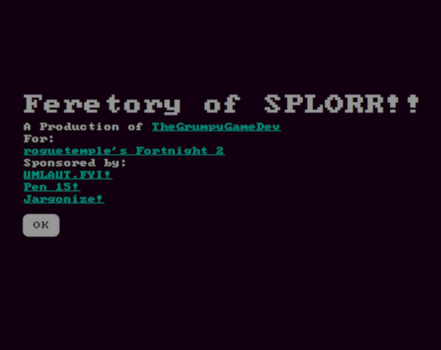
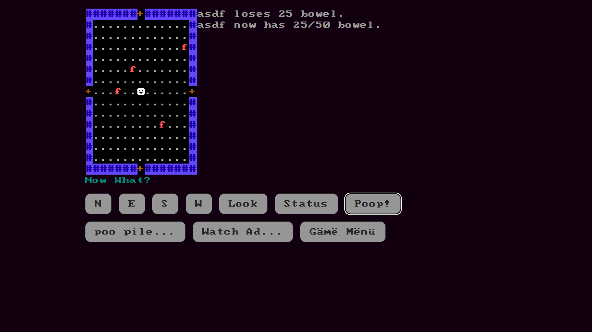

# Feretory of SPLORR!!

A Production of TheGrumpyGameDev



A turn-based maze crawl through a 5 by 4 grid of rooms. Eat, poop, keep your sanity, fill out tax forms, and find the keys to the dead ends. There is no way to win.

- Play it: https://thegrumpygamedev.itch.io/feretory-of-splorr
- Made for: [roguetemple's Fortnight 2](https://itch.io/jam/roguetemples-fortnight-2)



## Building

The game is being ported from VB.NET (`src/`) to Odin compiled to WebAssembly (`odin/`). See `docs/PORT_PLAN.md` for the rules and the plan, and `docs/QUIRKS.md` for the changes made along the way.

```bash
odin/test.sh                                # tests
odin/build.sh                               # builds odin/out
python3 -m http.server 8123 -d odin/out     # then open http://localhost:8123/
```

The original VB.NET version builds with `dotnet build src/Metaphor.slnx`.

## Notes

Design notes live in the author's Obsidian vault at `/home/yermom/git/bok-of-splorr/splorr/`.
